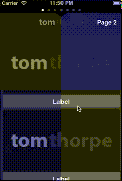
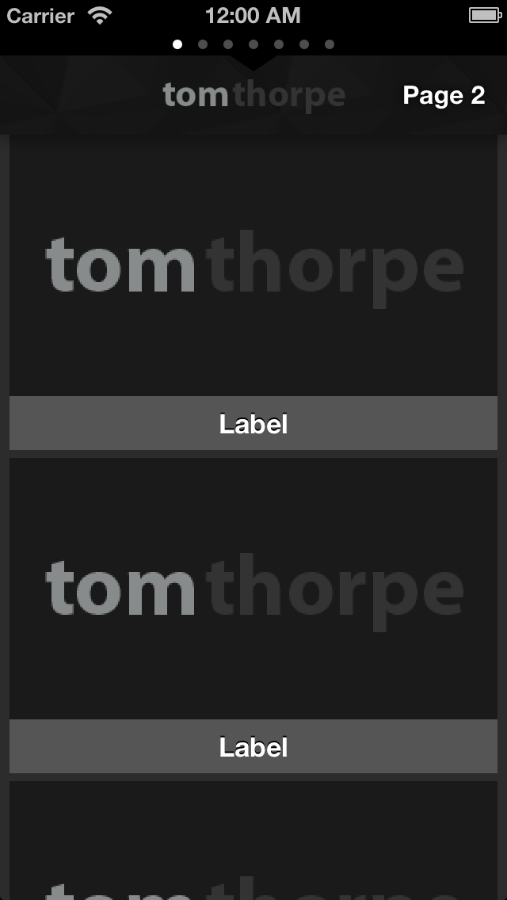
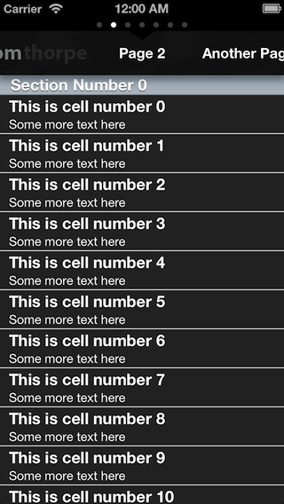
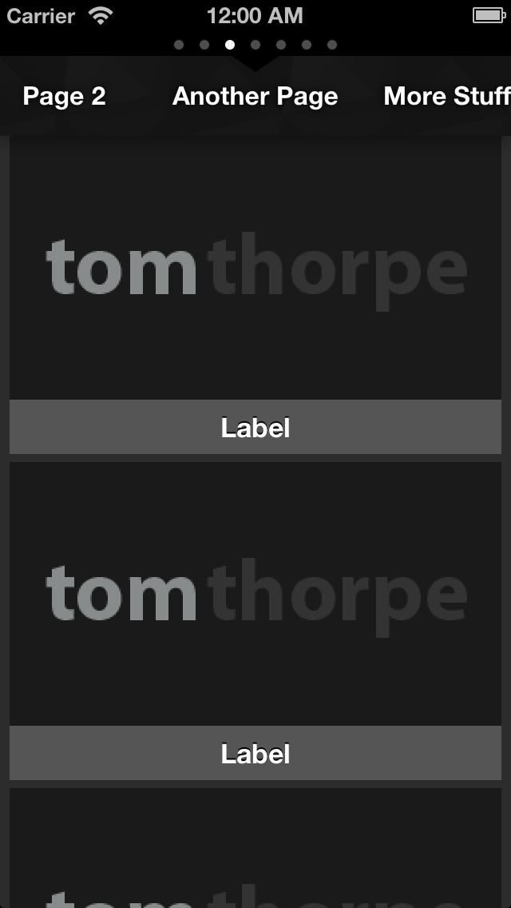
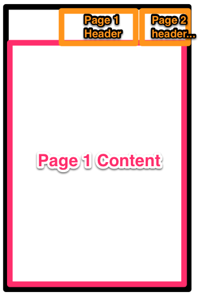

UIScrollSlidingPages
=========================
This control allows you to add multiple view controllers and have them scroll horizontally, each with a smaller header view that scrolls in proportion as the content scrolls. Similar in style to the Groupon app.

An example of an app using this control as it's main UI is the Tom Thorpe Photography app, available on the [App Store](https://itunes.apple.com/us/app/tom-thorpe-photography/id614901245?mt=8)

New in version 1.1
---
Added the extra new property `hideStatusBarWhenScrolling` to better suit how the status bar works in iOS7. 

In iOS7+ the status bar now overlaps the content, which caused a problem where this control was used full screen because the page dots (UIPageControl) now share the same space as the status bar.

This property is intended for when the UIScrollSlidingPages is full screen and the status bar is overlapping the UIPageControl page dots. If you set this new property to YES, the page dots disappear when not scrolling, and show the status bar instead. And vice versa when you *are* scrolling.

**For this property to work you need to add the "View controller-based status bar appearance" (UIViewControllerBasedStatusBarAppearance) key to info.plist and set it to a boolean of NO.**

If you keep the current behaviour and don't set the new property above, in iOS7 you may need to add the self.edgesForExtendedLayout = UIRectEdgeNone; to your view controller to preserve the space for the status bar and mean the views don't overlap

The default value is NO. I have changed the example project to set this project to YES though as I think it looks better in iOS7.

Example Screenshots
---
####Video:




####Screenshots:

  

  

######Same as above, but with titleScrollerHidden option set to YES:


What is UIScrollSlidingPages?
---
UIScrollSlidingPages is the project name for the `TTScrollSlidingPagesController` UIViewController. The control is a horizontal paged scroller complete with a header area, the standard "page dots" showing the current page, and an UI effect as you scroll between pages.



As mentioned above, the control contains two main "areas" - the content area and the header area. 

The content area takes up the full width of the control and is paged, meaning the user sees one page at a time. 

Each page in the content area has an associated header in the header area. The header of the current page is displayed in the centre of the header area. However, the header area items do not take up the full width, allowing the user to see the next and previous page headers. 

The header area can be hidden, however, by setting the `titleScrollerHidden` option to `YES` before the control is loaded.

The user may scroll horizontally between the pages by dragging left to right anywhere on the control, or tapping one of the pages in the header area. The two areas will stay in-sync to mean that the header of the current page is always in the centre of the header area.


Installation
---
* Include the files in the  `Source` directory somewhere in your project using the Add Files option of XCode, Submodules, or however you normally include files from external repositories.
* Add `#import "TTUIScrollViewSlidingPages.h"` in your source wherever you plan to use this control.
                                                                                                                                                                                                                                                        
Usage
---

### Instantiating the View Controller.

To use the control, create an instance of `TTScrollSlidingPagesController`. This is just a subclass of UIViewController, once you have instantiated it you can use the view property to add to your view like you would with any other UIViewController (normally by adding the `view` property of your instance as a subview to your current view, navigation controller, tab bar etc.). 

There is one main distinction, once you have instantiated `TTScrollSlidingPagesController` you should set the `dataSource` property, in a very similar way you would with a `UITableViewController`. The datasource should be set to an object that conforms to the `TTSlidingPagesDataSource` protocol. See the section below for details on implementing `TTSlidingPagesDataSource`.


For example, to instantiate `TTScrollSlidingPagesController` and add it to the current view from another view controller, do the following:

```  objc
    TTScrollSlidingPagesController slider = [[TTScrollSlidingPagesController alloc] init];
    slider.dataSource = self; /*the current view controller (self) conforms to the TTSlidingPagesDataSource protocol)*/
    slider.view.frame = self.view.frame; //I'm setting up the view to be fullscreen in the current view
    [scrollPagerView addSubview:slider.view];
    [self addChildViewController:slider]; //this makes sure the instance isn't released from memory :-)
```

###Implementing TTSlidingPagesDataSource
* `-numberOfPagesForSlidingPagesViewController:` This returns an integer which indicates how many pages the control has. The below two methods will then each be called this many times, one for each page.
* `-pageForSlidingPagesViewController:atIndex:` This returns the content view of the requested page (index) in the form of a `TTSlidingPage` instance. See below for a description of `TTSlidingPage`.
* `titleForSlidingPagesViewController:(TTScrollSlidingPagesController*)source atIndex:(int)index;` This returns the header of the requested page (either an image or text) in the form of a `TTSlidingPageTitle` instance. See below for a description of `TTSlidingPageTitle`.


#####TTSlidingPage
This is returned by the `TTSlidingPagesDataSource`. It represents the page content view for a a given page that will go in the content area. You can instantiate it either with a UIViewController using `-initWithContentViewController:(UIViewController *)contentViewController` (recommended), or using `initWithContentView:(UIView *)contentView;` if you only have a UIView and will manage the controller yourself. 

#####TTSlidingPageTitle
This is returned by the `TTSlidingPagesDataSource`. It represents the header for a given page that will go in the header area. It can either be an image or text. To instantiate it with an image use `initWithHeaderImage:(UIImage*)headerImage` or instantiate it with plain text use `initWithHeaderText:(NSString*)headerText`

####Full Example of implementing TTSlidingPagesDataSource

For example, to implement the TTSlidingPagesDataSource to your class, add "<TTSlidingPagesDataSource>" after your class name in the .h header file, for example:

``` objc
@interface TTViewController : UIViewController<TTSlidingPagesDataSource>{
}
```


Then implement the three datasource methods methods:

``` objc
-(int)numberOfPagesForSlidingPagesViewController:(TTScrollSlidingPagesController *)source{
    return 5; //5 pages. The below two methods will each now get called 5 times, one for 
}

-(TTSlidingPage *)pageForSlidingPagesViewController:(TTScrollSlidingPagesController*)source atIndex:(int)index{
    UIViewController *viewController = [[UIViewController alloc] init];    
    return [[TTSlidingPage alloc] initWithContentViewController:viewController]; //in reality, you would return an actual view controller for the page (given by index) that you want, rather than just a blank UIViewController. In the demo app in the repository, I return instances of my own UIViewController subclass; TabOneViewController and TabTwoViewController. You can also just use a UIView but this wont preserve the full view hierarchy unless you handle it yourself.
}

-(TTSlidingPageTitle *)titleForSlidingPagesViewController:(TTScrollSlidingPagesController *)source atIndex:(int)index{
    TTSlidingPageTitle *title;
    if (index == 0){ //for the first page, have an image, for all other pages use text
        //use a image as the header for the first page
        title= [[TTSlidingPageTitle alloc] initWithHeaderImage:[UIImage imageNamed:@"randomImage.png"]];
    } else {
        //all other pages just use a simple text header
        title = [[TTSlidingPageTitle alloc] initWithHeaderText:@"A page"]; //in reality you would have the correct header text for your page number given by "index"       
    }
    return title;
}

``` 

Options
---
You should set these options after you have instantiated the control, before you set the `dataSource` and before the control is displayed).

* `bool titleScrollerHidden` - Whether the title scroller bar is hidden or not. Set this to YES if you only want the pages, and don't want the titles at the top of the page. For now even if this is set to YES you will still need to implement the `-(TTSlidingPageTitle *)titleForSlidingPagesViewController:(TTScrollSlidingPagesController *)source atIndex:(int)index` method in your datasource class, but you can just return nil for everything. Default is NO.
* `int titleScrollerHeight` - The height in pixels of the header area. Default is 50px.
* `int titleScrollerItemWidth` - The width in pixels of each 'page' in the header area. The smaller this is the more of the next and previous pages you can see in the header. Default is 150px.
* `UIColor *titleScrollerBackgroundColour` - The background colour of the header area. As a tip, you can use the [UIColor colorWithPatternImage] method to set an image as the background here. The default is either the diagmonds.png background texture included with the source if you include it in your project (credit: from http://subtlepatterns.com/),  black if you dont. 
* `UIColor *titleScrollerTextColour` - The colour of the text in the header area. Default is white.
* `BOOL disableTitleScrollerShadow` - Allows you to disable the shadow effect on the text in the header area. Default is NO.
* `BOOL disableUIPageControl` - Allows you to disable the `UIPageControl` at the top of the page (this is the "page dots" that show you how many pages there are, and what the current page is). Default is NO.
* `int initialPageNumber` - Allows you to set a starting page number (zero-based, so first page is 0) for the page displayed (either on the first load, or afrer calling -reloadPages), which means for example you can start with pages to both the left and the right if you start at a page that isn't 0. Default is 0.
* `BOOL pagingEnabled` - Whether the content view "snaps" to each page. Default is YES.
* `BOOL zoomOutAnimationDisabled` - Whether the "zoom out" effect that happens as you scroll from page to page should be disabled. Default is NO.
* `BOOL hideStatusBarWhenScrolling` - Intended for use in iOS7+ and when the UIScrollSlidingPages control is full screen. 
	The new behaviour of iOS7 can result in the status bar overlapping the top of the UIScrollSlidingPages. If you set this property to YES, the page dots at the top of the screen will be hidden until the user starts scrolling, at which point the status bar is replaced with the page number dots until the user stops scrolling. 
	If you set this to YES, you also need to add the "UIViewControllerBasedStatusBarAppearance" key as a BOOLEAN in info.plist and set it to NO, the app will throw an exception to alert you of this if you don't. 
	See the example demo project where I have set this to YES for devices running iOS7+ as it looks best in iOS7+. If you use this in anything less than iOS7 it won't make sense unless in your view hierarchy you make sure the status bar overlaps the TTScrollSlidingPagesController. So unless you do that, it's probably best to enable this property conditionally if the device is iOS7+. Default is NO.
 
Methods
---
* `-(void)reloadPages` - Empties the control and reloads all the pages.
* `-(void)scrollToPage:(int)page animated:(BOOL)animated` Move to a specific page number. If animated is set to NO the change will be instant, otherwise the page will "scroll" to the page.
* `-(int)getCurrentDisplayedPage` - Returns the index of the page that is currently being displayed. The pages start at 0.


Demo
---
The included source is an XCode project which you can open to see a demo. You can refer to this demos for reference of how to use the library if anything is unclear :-)

The control is instantiated in `TTViewController.m`'s `viewDidLoad` method. There are then some of the options properties that have been commented out to mean the demo is using the defaults. Try uncommenting them and playing around. Finally, the app sets the dataSource property for the instance to `self`, then adds the view as a subView to the current view.

`TTViewController` also implements `TTSlidingPagesDataSource`. It returns 7 for the number of pages. For the headers, on page 0 it returns an image, on the remaining pages it returns text. For the page contents it returns alternating instances of `TabOneViewController` and `TabTwoViewController` - this could be any UIViewController. 

Incidentally, `TabOneViewController` and `TabTwoViewController` are actually instances of one of my other libraries, `UITableViewZoomController` which can be found here [https://github.com/TomThorpe/UITableViewZoomController](https://github.com/TomThorpe/UITableViewZoomController). This is a UITableViewController that fades and zooms each cell in as it appears like the Google+ app.


Limitation
---
Currently, despite using the same sort of `dataSource` delegate as UITableViewControllers do, the control still loads **ALL** the views as soon as it appears. This means if you have lots of pages it will still load them **all** into memory rather than being smarter and only loading the current (and possible next/previous) page. 
This has two main ramifications:
 
 * The control is best suited for only a few pages (probably less than 10 or so), otherwise you might start to see it slow down. 
 
 * The `viewDidAppear` method will get called for all the pages instantly, even those that aren't actually visible yet.
 
Some day in the future I might make it only load pages as they are needed, but I can't promise anything. I created this control for my own app, and it wasn't necessary for me as I only use a few pages. Sorry!


